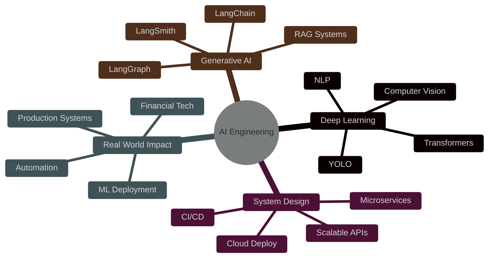

<div align="center">

# 👋 Hi, I'm Akshay Kumar

### Software Engineer | Generative AI • LLMs • Deep Learning

[](https://linkedin.com/in/akshaykumar0034)
[](https://leetcode.com/u/akshaykumar_07)
[](mailto:akshaykumar10001000@gmail.com)


</div>

---

## 🚀 About Me

```python
class AkshayKumar:
    def __init__(self):
        self.role = "Software Engineer"
        self.education = "B.Tech CSE @ Amity University (CGPA: 8.84)"
        self.specialization = ["Generative AI", "LLMs", "Deep Learning", "Spring Boot", "MicroServices"]
        
    def experience(self):
        return {
            "TATA Steel UISL": "AI Intern | IVRS System (95%+ accuracy)",
            "Surusha Technology": "Software Engineer Intern | EdTech Platform"
        }
    
    def tech_stack(self):
        return {
            "languages": ["Python", "Java", "SQL"],
            "ai_ml": ["LangGraph", "LangChain", "LangSmith", "YOLO", "Deep Learning"],
            "backend": ["Spring Boot", "FastAPI", "JPA", "Hibernate"],
            "databases": ["PostgreSQL", "MySQL", "MongoDB", "Pinecone", "Chroma", "FAISS"],
            "cloud_devops": ["AWS", "Docker", "CI/CD", "GitHub Actions"]
        }
    
    def achievements(self):
        return ["IBM National Hackathon Finalist", "SIH 2024 Regional Winner"]
```

---

## 🛠️ Tech Arsenal

<div align="center">

### Languages


### AI & Machine Learning


### Backend & Frameworks


### Frontend


### Databases


### Cloud & DevOps


### Vector Databases


</div>

---

## 💼 Featured Projects

<div align="center">

| Project | Description | Tech Stack | Links |
|---------|-------------|------------|-------|
| 🤖 **FinSight AI** | AI-powered financial analysis chatbot with real-time stock insights, sentiment scoring & interactive charts | LangGraph, LangChain, Gemini, Streamlit, SQLite | [GitHub](https://github.com/akshaykumar0034/FinSightAI) |
| 📊 **Investify** | High-performance trading platform with real-time portfolio valuation, P/L analytics & fund management | Spring Boot, React, PostgreSQL | [GitHub](https://github.com/akshaykumar0034/Investify) |
| 🚗 **IVRS System** | Intelligent Vehicle Recognition System using YOLOv8 & PaddleOCR (95%+ accuracy) | Python, YOLO, PaddleOCR, PostgreSQL | TATA Steel |
| 🌐 **EdTech Platform** | Responsive EdTech frontend with 20% engagement boost | React, Tailwind CSS | Surusha Tech |

</div>

---

## 📊 GitHub Analytics

<p align="center">
  
  
</p>

<p align="center">
  
</p>

<p align="center">
  
</p>

---

## 🎯 Current Focus



**What I'm Currently Doing:**
- 🔭 Building production-grade LLM applications with LangGraph and LangChain
- 🌱 Deepening expertise in system design and scalable backend architectures
- 👯 Open to collaborating on AI/ML projects and innovative solutions
- 💡 Passionate about leveraging AI to solve real-world problems

---

## 🏆 Achievements & Certifications

<div align="center">

### 🥇 Hackathons & Competitions
[](https://drive.google.com/file/d/1f-C1UA4hT0UcU1ihCEFp_RESF_-yvzN0/view?usp=sharing)
[](https://drive.google.com/file/d/1yBux3uMAX8FOXji94oxzX220ryNchfti/view?usp=sharing)

### 📜 Certifications
[](https://www.hackerrank.com/certificates/iframe/4fde6870d36d)
[](https://www.cloudskillsboost.google/public_profiles/c59e474c-a570-4c76-9e28-f067c61d963d/badges/14176722)


</div>

### 🎓 Education
- **B.Tech in Computer Science & Engineering** | Amity University Ranchi | **CGPA: 8.84/10**
- **Higher Secondary (Science)** | St. John's Inter College | **92.40%**

---

## 💻 Coding Profiles

<div align="center">

[](https://leetcode.com/u/akshaykumar_07/)

</div>

---

## 📈 Contribution Graph

<p align="center">
  
</p>

---

## 🔥 What I'm Working On

- 🚀 **Advanced RAG Systems:** Building retrieval-augmented generation pipelines with LangGraph
- 🤖 **Agentic AI:** Developing autonomous AI agents for complex workflows
- 📊 **Production ML:** Deploying scalable machine learning systems on AWS
- 💼 **Open Source:** Contributing to AI/ML projects and building developer tools

---

## 📫 Let's Connect!

<div align="center">

**I'm always open to discussing new projects, creative ideas, or opportunities!**

[](https://linkedin.com/in/akshaykumar0034)
[](mailto:akshaykumar10001000@gmail.com)
[](https://leetcode.com/u/akshaykumar_07)

**💼 Open to Full-Time Opportunities | 🎯 Seeking roles in AI/ML Engineering**

</div>

---

<div align="center">

### 💭 Random Dev Quote


### 👀 Profile Views


---


**⭐️ If you find my projects interesting, consider starring them!**

*"Building AI solutions that make a difference, one commit at a time."*

</div>
